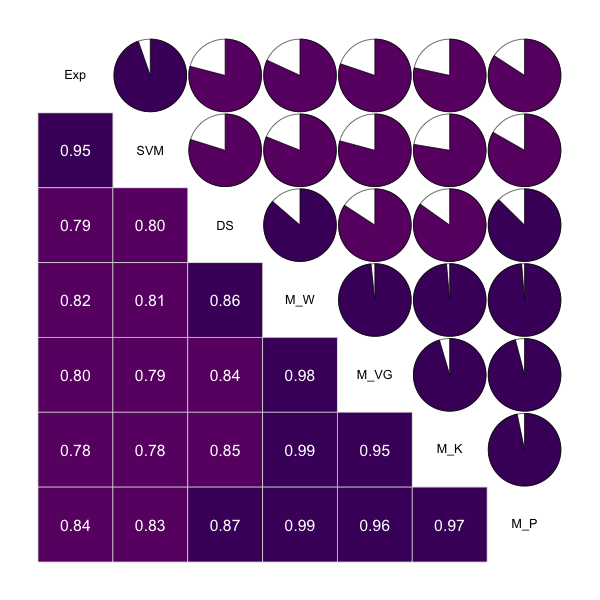

# logD<sub>7.4</sub> of 1,130 Compounds 

This repository archives a high-quality hand-curated [lipophilicity dataset](logd74.tsv) that includes the chemical structure (SMILES) of 1,130 organic compounds and their _n_-octanol/buffer solution distribution coefficients at pH 7.4 (logD<sub>7.4</sub>), originally curated by [our paper](http://onlinelibrary.wiley.com/doi/10.1002/cem.2718/full) ([PDF](https://nanx.me/papers/logd.pdf)).

## About logD<sub>7.4</sub>

As a determinant of several ADME properties, lipophilicity (logD<sub>7.4</sub>) is a key physical property in the development of small molecule oral drugs. This dataset can be applied for method benchmarking in regression modeling, cheminformatics, and chemometrics research.

## Paper Citation

If you find this dataset useful in your research, please cite our paper:

Formatted citation:

Wang, J-B., D-S. Cao, M-F. Zhu, Y-H. Yun, N. Xiao, Y-Z. Liang (2015). _In silico_ evaluation of logD<sub>7.4</sub> and comparison with other prediction methods. _Journal of Chemometrics_, 29(7), 389-398.

BibTeX entry:

```
@article{logd2015,
  title={\textit{In silico} evaluation of $\text{logD}_{7.4}$ and comparison with other prediction methods},
  author={Wang, Jian-Bing and Cao, Dong-Sheng and Zhu, Min-Feng and Yun, Yong-Huan and Xiao, Nan and Liang, Yi-Zeng},
  journal={Journal of Chemometrics},
  volume={29},
  number={7},
  pages={389--398},
  year={2015},
  publisher={Wiley Online Library}
}
```
